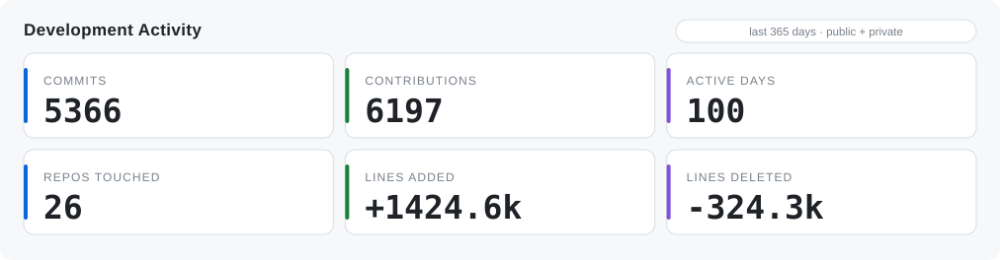
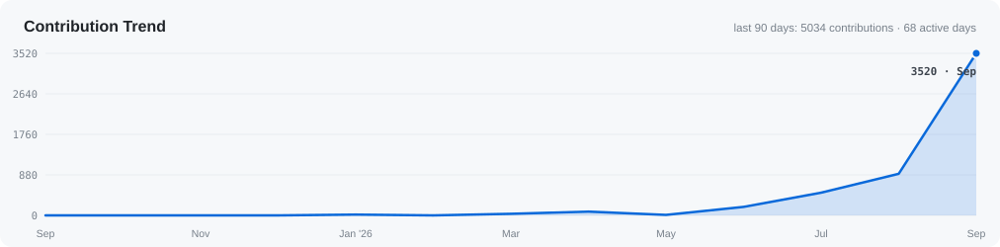
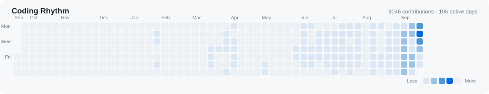
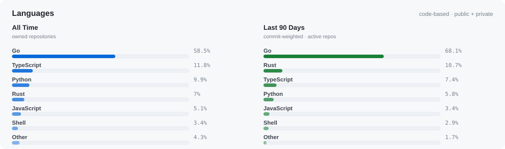

<h1 align="center">XiaBee</h1>

  <strong>Security · Systems · Backend · Data</strong> 
  Building useful systems, one commit at a time. 
  Security Engineer at <a href="https://pingcap.com">PingCAP</a> · CS graduate of <a href="https://www.bit.edu.cn/">Beijing Institute of Technology</a>

  <a href="https://blog.xiabee.cn">Blog</a> ·
  <a href="https://ossinsight.xiabee.cn/">Developer Dashboard</a> ·
  <a href="https://github.com/xiabee?tab=repositories">Repositories</a> ·
  <a href="https://space.bilibili.com/43789348">Bilibili</a> ·
  <a href="https://www.zhihu.com/people/xiao-53-1">Zhihu</a> ·
  <a href="https://x.com/xiabeeSec">X</a>

  
  
  

---

## ⚡ Development Activity

<picture>
  <source media="(prefers-color-scheme: dark)" srcset="./assets/metrics/overview-dark.svg">
  <source media="(prefers-color-scheme: light)" srcset="./assets/metrics/overview-light.svg">
  
</picture>

<picture>
  <source media="(prefers-color-scheme: dark)" srcset="./assets/metrics/trend-dark.svg">
  <source media="(prefers-color-scheme: light)" srcset="./assets/metrics/trend-light.svg">
  
</picture>

<picture>
  <source media="(prefers-color-scheme: dark)" srcset="./assets/metrics/heatmap-dark.svg">
  <source media="(prefers-color-scheme: light)" srcset="./assets/metrics/heatmap-light.svg">
  
</picture>

> **Public + private activity**, aggregated. Numbers refresh daily from the
> GitHub API — no hand-edited stats. Metric definitions live in
> [`docs/PROFILE_METRICS.md`](./docs/PROFILE_METRICS.md), live views in the
> [Developer Dashboard](https://ossinsight.xiabee.cn/).

---

## 🧭 Focus

| | | |
| --- | --- | --- |
| 🐹 **Go** | backend services · infrastructure · static binaries | ██████████ |
| 🦀 **Rust** | systems tooling · async software | ██████ |
| 🐍 **Python** | data pipelines · automation · analysis | ███████ |
| ⚙️ **Systems** | reliable services · CLI/TUI · Linux | ███████ |
| 🛡️ **Security** | secure-by-design engineering · analysis | ██████ |
| 📊 **Data** | databases · analytics · observability | █████ |

---

## 🗣 Languages

<picture>
  <source media="(prefers-color-scheme: dark)" srcset="./assets/metrics/languages-dark.svg">
  <source media="(prefers-color-scheme: light)" srcset="./assets/metrics/languages-light.svg">
  
</picture>

---

## 🛠 Tech Stack

  

  
  

---

## 🔭 Explore More

  <a href="https://ossinsight.xiabee.cn/">
    <picture>
      <source media="(prefers-color-scheme: dark)" srcset="https://img.shields.io/badge/Open_Developer_Dashboard-0A1929?style=for-the-badge&logo=vercel&logoColor=4CC2FF">
      <source media="(prefers-color-scheme: light)" srcset="https://img.shields.io/badge/Open_Developer_Dashboard-F6F8FA?style=for-the-badge&logo=vercel&logoColor=0969DA">
      
    </picture>
  </a>

  <a href="https://blog.xiabee.cn">Read the blog</a> ·
  <a href="https://github.com/xiabee?tab=repositories">Browse repositories</a> ·
  <a href="https://ossinsight.xiabee.cn/">Live analytics</a>

